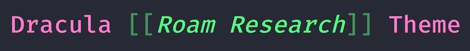
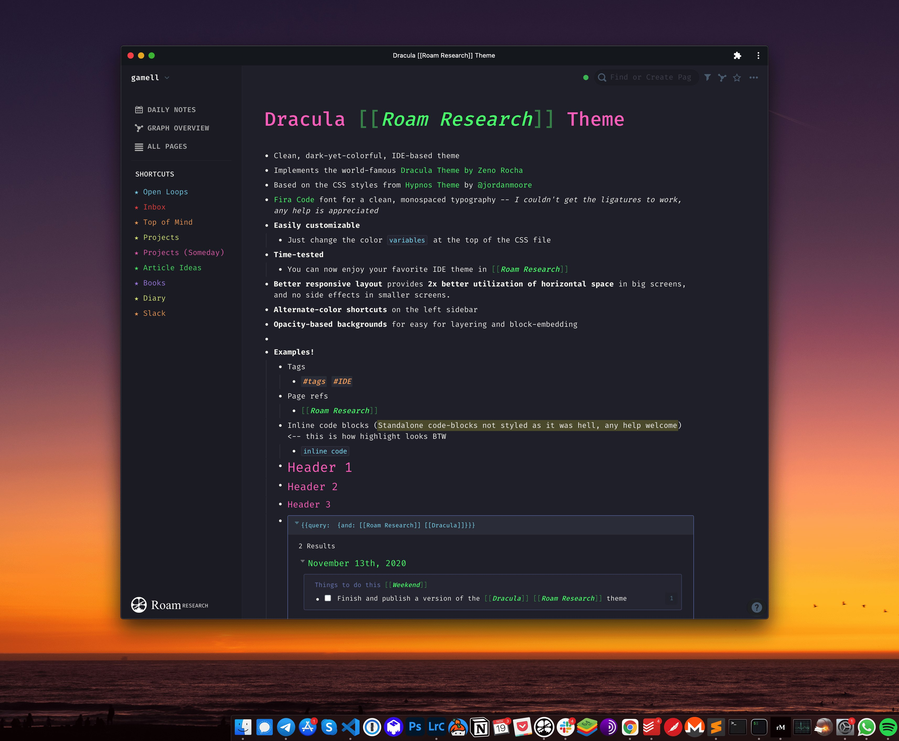

# Gambler Dracula 🎰



Clean & dark Dracula Theme for Roam Research

# Credits

- CSS stylesheet based on [Hypnos theme](https://github.com/jordanmoore/hypnos) by [@jordanmoore](https://twitter.com/jordanmoore)
- Color pallette from [Dracula Theme](https://github.com/dracula/dracula-theme) by [Zeno Rocha](https://draculatheme.com/)

# Installation

- Open or create your `[[roam/css]]` page in your roam instance
- In a code block (tripple \` backticks)
  - paste this single line: `@import url('https://gamell.io/roam-gambler-dracula/style.css');` -- this way you will automatically get any update I make to the theme, OR
  - paste the entirety of `style.css` (with your optional customizations)
- Enjoy the theme

Alternatively, you can also

- Install Stylus Chrome Extension
- Create a new Style override for `roamresearch.com` and
  - paste this single line: `@import url('https://gamell.io/roam-gambler-dracula/style.css');` -- this way you will automatically get any update I make to the theme, OR
  - paste the entirety of `style.css` (with your optional customizations)

# Feartures



- Enjoy your favorite theme in Roam Research
- Dark yet colorful: easy on the eyes and clean
- Monospace font for that hacker in you (if anyone knows how to enable the font's -- `Fira Code` -- ligatures, please let me know, thanks!)
- Better utilization of the horizontal space in big screens thanks to a better responsive layout
- Easily customizable! (see below)

# Customization

You can easily customize the colors by changing lines `66-72` of the file or, alternatively, overwriting the colors directly in your `roam/css` page. Just paste this and change the colors at will:

```css
@import url('https://gamell.io/roam-dracula/style.css');
:root {
  /* PRIMARIES FROM DRACULA THEME */
  --color-green: #50fa7b;
  --color-orange: #ffb86c;
  --color-blue: #8be9fd;
  --color-purple: #bd93f9;
  --color-pink: #ff79c6;
  --color-red: #ff5555;
  --color-yellow: #f1fa8c;

  /* CUSTOMIZE HIGHLIGHT COLORS HERE */
  --color-headers: var(--color-yellow);
  --color-links: var(--color-green);
  --color-bracket-links: var(--color-green);
  --color-tag-links: var(--color-orange);
  --color-code: var(--color-blue);
  --color-other-highlights: var(--color-blue);
}
```


# Contribute

I did my best to style all the UI, but I am sure I missed some spots, so any fixes & contributions are very welcome :)
